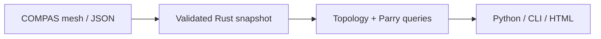

# COMPAS Forge
<!-- publication-example -->


The retained tetrahedron demo reports three boundary edges when one face is missing and zero when it is restored. These are actual API results, not a rendered mockup.

[Run this example](publication/README.md) · [Release scope](SOURCE-RELEASE.md) · [Introduction draft](publication/linkedin.md)

## Implemented workflow

- Mesh topology diagnostics and conservative repair operations.
- Rigid-motion collision queries with explicit convergence metadata.
- Headless COMPAS FAB trajectory preflight through model forward kinematics.
- Python and CLI fabrication-profile reports with explicit units and limits.

<!-- /publication-example -->

[Source release and practical use](SOURCE-RELEASE.md) · [Report a reproducible issue](CONTRIBUTING.md)


**Research software · MIT · Source and validation available**

Inspect COMPAS meshes before downstream geometry and fabrication tasks. A Rust core exposes topology diagnostics, repair operations, assembly queries and fabrication profiles through Python and a command-line interface.

[Quick start](#build-and-test) · [Implementation evidence](CLAIMS.md) · [Validation](VALIDATION.md) · [Contributing](CONTRIBUTING.md)

## How it works

Simple planar polygons are projected to their dominant plane and triangulated with ear clipping. Vertex-link connectivity complements edge-incidence diagnostics. Translation-only sweeps use Parry's linear shape cast. Rotational sweeps use exact rigid-motion interpolation over bounded angular substeps and normalized time **0–1**. Every hit reports whether the underlying solver converged or returned a conservative approximation.



## Build and test

Use CPython 3.11 or later and a recent stable Rust toolchain. The local audit used CPython 3.14 and Rust 1.96 on Windows x64. Python package metadata allows 3.9+, but the full version matrix remains to be tested.

```sh
python -m venv .venv
# Activate .venv for your shell.
python -m pip install maturin pytest
maturin develop --release
python -m pytest tests -q
compas-forge --help
```

```python
from compas.datastructures import Mesh
from compas_forge import analyze_mesh

mesh = Mesh.from_vertices_and_faces([[0,0,0], [1,0,0], [0,1,0]], [[0,1,2]])
report = analyze_mesh(mesh)
print(report["boundary_edges_count"])  # 3
```

The names containing `zero_copy` remain as compatibility aliases; the clear
high-level APIs are `analyze_mesh`, `repair_mesh`, `preflight_mesh`,
`sweep_collision`, `sweep_compas_fab_trajectory`, and `assembly_contacts`.

## COMPAS FAB trajectory demo

Install the optional integration and run the retained headless UR5 example:

```sh
python -m pip install ".[fab]"
python examples/example_compas_fab_trajectory.py
```

The example loads COMPAS FAB's UR5 model, computes endpoint frames with model
forward kinematics, and places an obstacle between two clear endpoints. An
endpoint-only check misses the obstacle; the continuous sweep reports the
intermediate trajectory fraction, solver method and convergence status.

## Reproducible timing experiment

```sh
python generate_benchmarks.py --sizes 20 40 80 --repetitions 7 --output benchmark-results.json
```

This records raw timings and environment metadata for actual buffer construction and Rust diagnostics. The stages do different work; their ratio is not a Python/Rust speedup. Build the release extension first. Older charts based on an incorrectly attributed COMPAS call have been withdrawn.

The presentation-candidate run is retained in
[`benchmark-results-presentation.json`](benchmark-results-presentation.json):
7 repetitions per workload on Windows/CPython 3.14, with raw samples and no
cross-library speedup claim.

## Implementation and evidence

| Capability | Implementation | Verification |
|---|---|---|
| Boundary and vertex-manifold diagnostics | [Code](src/geometry.rs) | [Evidence](tests/test_mesh_api.py): Open triangle, closed tetrahedron and disconnected vertex fans |
| Concave polygon triangulation | [Code](src/geometry.rs) | [Evidence](tests/test_mesh_api.py): U-shaped face preserves analytical area |
| Translation and rotation sweeps | [Code](src/lib.rs) | [Evidence](tests/test_mesh_api.py): Analytical translation TOI and rotation-only intermediate contact |
| COMPAS FAB trajectory adapter | [Code](python/compas_forge/__init__.py) | [Evidence](tests/test_compas_fab_integration.py): UR5 model FK and intermediate collision missed by endpoints |
| Assembly contact interfaces | [Code](src/lib.rs) | [Evidence](tests/test_mesh_api.py): deterministic part ordering and analytical contact area |
| Python / CLI validation | [Code](python/compas_forge) | [Evidence](tests/test_cli.py): Sparse vertex keys, malformed buffers and CLI input handling |

**Local validation:** 35 Python tests, 4 Rust unit tests, Rust formatting, Clippy with warnings denied, and a release build. Tests were run on Windows x64; this is a local result, not a remote CI badge. See [VALIDATION.md](VALIDATION.md) for commands and untested integration boundaries.

## Scope and assumptions

Self-intersection, self-touching polygons, material behaviour and robot safety are outside the checks. Ear clipping assumes simple planar faces; contact clipping is intended for convex coplanar faces. A closed triangle surface can contain another without surface intersection, so clash queries are not a general solid-containment predicate. Profile values assume metres and are built-in heuristics, not manufacturing certification. COMPAS FAB joint trajectories are approximated piecewise between their sampled FK frames; denser sampling remains the caller's responsibility. A `Failed` or `OutOfIterations` CCD status is retained as a conservative hit and its contact geometry is marked unreliable. Names containing `zero_copy` are compatibility APIs: input data is copied into owned Rust memory. No comparative speedup has been established.

## Method references

[COMPAS](https://compas.dev/) · [COMPAS FAB](https://compas.dev/compas_fab/latest/) · [Parry shape casting](https://docs.rs/parry3d-f64/latest/parry3d_f64/query/) · [PyO3 buffer semantics](https://pyo3.rs/main/doc/pyo3/buffer/struct.readonlycell)

References identify underlying methods and platforms. They do not establish novelty or comparative superiority of this implementation.

## Development

Changes and validation are recorded in [CHANGELOG.md](CHANGELOG.md) and [CLAIMS.md](CLAIMS.md). Issues are most useful with a minimal input, expected output, actual output and environment versions. See [CONTRIBUTING.md](CONTRIBUTING.md).

Copyright Mohammad Amin Moradi. Distributed under the [MIT License](LICENSE).


## Current source release

[Current release checks](RELEASE_CHECK.md) - locally checked 6 October 2026; research source distribution.
