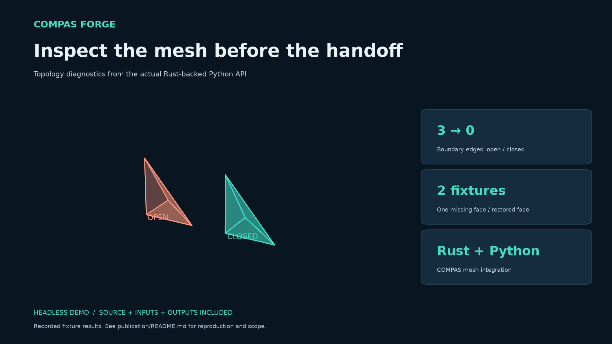

# COMPAS Forge

Rust-backed mesh QA and trajectory preflight for COMPAS and COMPAS FAB 2.
Check geometry and a planned path before a downstream fabrication handoff;
retain the diagnostics, exclusions, assumptions and unresolved results.

**[0.4.0 research prerelease](https://github.com/moaminmo/compas-forge/releases/tag/v0.4.0-rc.1) · MIT.**
16 platform/ABI wheels and a source archive are available. All 32 release CI
jobs passed; GitHub-built Windows wheels also passed inside Rhino 8/9.
See [publication evidence](PUBLICATION_20261008.md). Not certified for physical robot safety.
Passing these checks does not authorize
execution on a robot.

## What Forge adds

COMPAS already runs directly in Rhino's CPython, and FAB already has collision
backends. Forge complements them; it does not replace COMPAS, a planner or a
controller. Its contribution is a retained, in-process Rust preflight workflow:

- Deterministic topology, welding and repair diagnostics for COMPAS meshes.
- Continuous rigid-motion queries and distance-bound clearance intervals with
  explicit `clear`, `violation` and `unknown` outcomes.
- COMPAS FAB 2 cell geometry, attachment/touch/SRDF exclusions, partial joint
  paths, bounded articulated interpolation, synchronized scene/tool paths and
  continuity-checked attachment phases.
- Opt-in restricted solid containment, including nested even-odd shells.
- Owned cached meshes, native result dictionaries, GIL-released heavy kernels
  and ordered optional Rayon batches. Prepared contiguous buffers additionally
  support a borrowed structural scan; normal COMPAS ingestion still copies.

See [lab workflow](LAB_WORKFLOW.md), [mathematical contracts](ROBUSTNESS.md),
[clearance semantics](CLEARANCE.md) and [claim evidence](CLAIMS.md).

## Install the candidate

Build from this checkout with stable Rust and CPython (3.9 or newer), or install
an audited wheel matching your interpreter and platform:

```sh
python -m pip install ".[fab]"
# Alternatively, use the actual downloaded wheel filename:
python -m pip install "./compas_forge-0.4.0-cp313-cp313-win_amd64.whl[fab]"
python examples/consumer_install_check.py
compas-forge --help
```

Download the matching wheel from the linked GitHub prerelease. The command
uses the actual Windows CPython 3.13 asset name; no PyPI upload is claimed.
Rhino needs its embedded CPython ABI, not IronPython.
Prepared contexts must be closed and recreated when geometry/state changes.
All geometry in a cell must use consistent units; fabrication profiles use metres.

## Evidence and release status

Actual Windows Rhino 8 and Rhino 9 WIP host smoke checks passed, including
RhinoCommon conversion and Grasshopper DataTree marshaling. This is **not** a
full Grasshopper Python component/recompute test. Current test counts and
artifact identities live in [the final release check](RELEASE_CHECK.md).

The retained rotating-cell broadphase ablation measured 12.05 ms versus
24.24 ms median (2.01x) on one Windows machine, 11 alternating runs per mode;
preparation was excluded. This compares filtered/unfiltered Forge, **not Rust
versus Python or COMPAS**. [Raw evidence](benchmark-clearance-filter-reviewed-20261008.json).

The [Persian review](REVIEW_FA_20261008.md) and
[technical Q&A](TECHNICAL_QA_FA.md) explain the contribution and limitations.
Cross-platform CI passed for the released source. Full GH graph testing and
physical lab acceptance remain open gates. HTML's interactive viewer currently needs internet/CDN
access; JSON and CLI results do not.

<!-- publication-example -->



The retained tetrahedron demo reports three boundary edges when one face is missing and zero when it is restored. These are actual API results, not a rendered mockup.

[Run this example](publication/README.md) · [Release scope](SOURCE-RELEASE.md) · [Introduction draft](publication/linkedin.md)

## Implemented workflow

- Mesh topology diagnostics and conservative repair operations.
- Rigid-motion collision queries with explicit convergence metadata.
- Headless COMPAS FAB trajectory preflight through model forward kinematics.
- Python and CLI fabrication-profile reports with explicit units and limits.

<!-- /publication-example -->

[Source release and practical use](SOURCE-RELEASE.md) · [Report a reproducible issue](CONTRIBUTING.md)


**Research software · MIT · Source and validation available**

Inspect COMPAS meshes before downstream geometry and fabrication tasks. A Rust core exposes topology diagnostics, repair operations, assembly queries and fabrication profiles through Python and a command-line interface.

[Quick start](#build-and-test) · [Implementation evidence](CLAIMS.md) · [Forum commitments](FORUM_COMMITMENTS.md) · [Ecosystem gap](GAP_ANALYSIS.md) · [Validation](VALIDATION.md) · [Contributing](CONTRIBUTING.md)

## How it works

Simple planar polygons are projected to their dominant plane and triangulated with ear clipping. Vertex-link connectivity complements edge-incidence diagnostics. Translation-only sweeps use Parry's linear shape cast. Rotational sweeps use exact rigid-motion interpolation over bounded angular substeps and normalized time **0–1**. Every hit reports solver status and an independently recomputed distance residual at the reported impact poses.


## Build and test

Use CPython 3.11 or later for development and a recent stable Rust toolchain.
Python 3.9 remains supported specifically for Rhino 8. The local audit built
and imported Windows wheels with CPython 3.9, 3.13 and 3.14; the full
Linux/Windows/macOS CI matrix passed on GitHub Actions for the released source.

```sh
python -m venv .venv
# Activate .venv for your shell.
python -m pip install maturin ".[test]"
maturin develop --release
python -m pytest tests -q
compas-forge --help
```

```python
from compas.datastructures import Mesh
from compas_forge import analyze_mesh

mesh = Mesh.from_vertices_and_faces([[0,0,0], [1,0,0], [0,1,0]], [[0,1,2]])
report = analyze_mesh(mesh)
print(report["boundary_edges_count"])  # 3
```

### Rhino 8 and Rhino 9

COMPAS Forge is a native extension, so its wheel must match Rhino's embedded
CPython ABI and operating-system architecture. The release workflow therefore
builds explicit `cp39` wheels for Rhino 8 and `cp313` wheels for Rhino 9; a
source-only package is not a practical Rhino installation unless a Rust
toolchain is also available.

On this Windows machine, the wheel built against Rhino 8's actual
`~/.rhinocode/py39-rh8/python.exe` passed both an isolated runtime test and an
in-process Rhino 8 test beside COMPAS 2.15.1, including native analysis of a
COMPAS `Mesh`. A separate `cp313-win_amd64` wheel passed the same isolated ABI
test. Actual Rhino 9 WIP also passed an in-process smoke check on this machine;
the final corresponding reports are `rhino8-host-final-review-20261008.json` and
`rhino9-host-final-review-20261008.json`. Full Grasshopper component-graph and
recompute behaviour remains an unexecuted release gate.
Installation and host verification are documented in [`RHINO.md`](RHINO.md).

The names containing `zero_copy` remain as compatibility aliases; the clear
high-level APIs are `analyze_mesh`, `repair_mesh`, `preflight_mesh`,
`sweep_collision`, `sweep_compas_fab_trajectory`, and `assembly_contacts`.

For producers that already own contiguous `float64` vertices and `int32`
indices/offsets, `scan_mesh_buffers_borrowed` performs an allocation-free Rust
structural scan directly over the borrowed input. `scan_mesh_ingress` is the
COMPAS convenience wrapper, but packing a COMPAS `Mesh` into arrays is still an
explicit copy. Retained CCD intentionally constructs one owned snapshot so it
can release the GIL and serve concurrent queries safely.

COMPAS 2.15 does not expose `Mesh.is_closed` or `Mesh.is_manifold` as plugin
extension points. Forge therefore provides explicit, reversible acceleration
instead of changing global class behaviour merely on import:

```python
import compas_forge

with compas_forge.mesh_acceleration():
    closed = mesh.is_closed()
    manifold = mesh.is_manifold()
```

The adapter preserves tested COMPAS predicate semantics, supports nested
contexts and restores the original methods when the context exits.

The dedicated predicate kernel performs a single borrowed-buffer topology pass;
it deliberately excludes coordinates, triangulation, self-intersection and
volume. A rigorous pyperf run on a closed 16,384-quad torus measured COMPAS
`Mesh.is_closed()` plus `Mesh.is_manifold()` at `40.0 ± 0.7 ms`, Forge
end-to-end including Python packing at `24.1 ± 1.8 ms` (`1.66x`), and the Forge
kernel with prepacked buffers at `14.9 ± 1.4 ms` (`2.68x`). Pyperf marked both
Forge workloads as not proving sub-1% variation; the raw result is retained in
[`pyperf-topology-presentation-candidate.json`](pyperf-topology-presentation-candidate.json).

## COMPAS FAB trajectory demo

Install the optional integration and run the retained headless UR5 example:

```sh
python -m pip install ".[fab]"
python examples/example_compas_fab_trajectory.py
```

The example loads COMPAS FAB's UR5 model, computes endpoint frames with model
forward kinematics, and places an obstacle between two clear endpoints. An
endpoint-only check misses the obstacle; the continuous sweep reports the
intermediate trajectory fraction, solver method and convergence status.

For full robot-link collision geometry and self-collision preflight:

```sh
python examples/example_compas_fab_full_robot.py
```

This uses COMPAS FAB 2's `RobotCellLibrary`, retains seven UR5 link meshes in
the Rust cache, excludes adjacent-link pairs, adaptively subdivides joint
motion, respects the RobotCell's SRDF disabled-collision pairs and checks every
remaining pair with CCD. The retained current-version
example detects a converged intermediate `upper_arm_link` / `wrist_3_link`
collision at 84.825% of the trajectory with an independently verified distance
residual near `2.58e-10`.

For a complete COMPAS FAB 2 cell containing a robot, attached tool,
workpiece and stationary rigid body:

```sh
python examples/example_compas_fab_cell.py
```

`sweep_compas_fab_cell_trajectory` mirrors the five collision-pair classes of
the FAB 2 PyBullet backend while adding piecewise continuous sweeps between
trajectory states: robot self-collision, robot/tool, robot/rigid-body,
attached-body/body and tool/body. `RobotCellState` hidden objects, touch links,
touch bodies, SRDF exclusions, attachment frames and the robot base frame are
applied. The retained `ur5_gripper_one_beam` fixture builds 31 permitted pair
queries and attributes the initial beam/floor overlap to `body:beam` and
`body:floor`.

Cell pair queries cross the Python/Rust boundary as one ordered batch. Rust
clones the retained `Arc` mesh handles under one registry read lock, releases
the GIL once and optionally evaluates the batch with Rayon. Before Parry's
narrowphase, a conservative swept-sphere AABB rejects pairs that cannot meet,
including under rotation; the result reports how many queries were rejected.
This broadphase is deliberately conservative and may keep false candidates,
but it must not discard a possible contact.

Before a FAB sweep, `validate_compas_fab_trajectory` checks joint identity and
order, finite numeric fields, URDF position limits, declared velocity limits,
monotonic timestamps and timestamp-derived average joint velocity. It returns
machine-readable errors and every sweep rejects an invalid trajectory before
registering or querying collision meshes. When valid point timing is present,
collision results also report the physical time from trajectory start, total
duration and normalized time fraction; without timing those fields remain
`None` instead of presenting an invented timestamp.

## Reproducible timing experiment

For repeated paths, prepare native cell geometry once:

```python
with compas_forge.prepare_compas_fab_cell(cell, state) as prepared:
    collision = prepared.sweep(trajectory)
    clearance = prepared.verify_clearance(trajectory, clearance=0.005)
```

The copied snapshot has an explicit lifetime and preserves unmentioned joint
positions in partial trajectories. Reprepare after changing geometry or cell
state. Clearance uses Rust interval subdivision with a relative-motion bound;
results are `clear`, `violation` or `unknown`. Numerical and articulated-motion
assumptions are documented in [CLEARANCE.md](CLEARANCE.md). This does not turn
surface-distance evidence into a solid-containment or physical safety guarantee.

Measure setup amortization separately on stationary and moving workloads:

```sh
python benchmark_prepared_cell.py --fixture stationary_cell --output benchmark-prepared-cell.json
python benchmark_prepared_cell.py --fixture moving_robot --output benchmark-prepared-moving.json
```

```sh
python generate_benchmarks.py --sizes 20 40 80 --repetitions 7 --output benchmark-results.json
```

This records raw timings and environment metadata for actual buffer construction and Rust diagnostics. The stages do different work; their ratio is not a Python/Rust speedup. Build the release extension first. Older charts based on an incorrectly attributed COMPAS call have been withdrawn.

The presentation-candidate run is retained in
[`benchmark-results-presentation.json`](benchmark-results-presentation.json):
7 repetitions per workload on Windows/CPython 3.14, with raw samples and no
cross-library speedup claim.

CCD latency has a separate correctness-gated experiment:

```sh
python benchmark_ccd.py --repetitions 10000 --rotation-repetitions 30 --warmups 300
```

One local Windows/CPython 3.14 release run measured the retained cached-linear
fixture at 3.7 us median (4.1 us p95, 5.0 us p99) through the native-dict path,
versus 8.5 us median through the JSON compatibility path. This is a narrowly
scoped Python/Rust boundary comparison on one machine, not a universal or
cross-library speed claim. Raw samples and environment metadata are emitted by
the script.

For process-isolated calibration with Python's standard benchmarking toolkit:

```sh
python -m pip install ".[benchmark]"
python benchmark_pyperf.py --rigorous --output pyperf-ccd.json
```

The pyperf names preserve the exact work boundary: borrowed structural scan,
cached CCD returning a native dictionary, and cached CCD serialized to JSON and
decoded back to a Python object.

The retained rigorous presentation-candidate run on the documented 24-logical-
CPU Windows/CPython 3.14 machine measured means of `1.07 us` for the borrowed
scan, `3.40 us` for cached linear CCD returning a native dictionary, and
`8.78 us` for the JSON compatibility round trip. The native-dict workload still
carried pyperf's sub-1%-variation warning, so the raw evidence is retained in
[`pyperf-presentation-candidate.json`](pyperf-presentation-candidate.json) and
the values remain machine/fixture-specific.

The native Rust kernel has a separate Criterion fixture that excludes Python,
JSON and mesh construction:

```sh
cargo bench --features bench-support --bench native_ccd
```

## Implementation and evidence

| Capability | Implementation | Verification |
|---|---|---|
| Boundary and vertex-manifold diagnostics | [Code](src/geometry.rs) | [Evidence](tests/test_mesh_api.py): Open triangle, closed tetrahedron and disconnected vertex fans |
| Concave polygon triangulation | [Code](src/geometry.rs) | [Evidence](tests/test_mesh_api.py): U-shaped face preserves analytical area |
| Translation and rotation sweeps | [Code](src/lib.rs) | [Evidence](tests/test_mesh_api.py): Analytical translation TOI and rotation-only intermediate contact |
| Deterministic tolerance welding | [Code](src/geometry.rs) | [Evidence](tests/test_mesh_api.py): Euclidean tolerance across spatial-hash cell boundaries |
| Self-intersection diagnostics | [Code](src/geometry.rs) | [Evidence](tests/test_mesh_api.py): RTree triangle broad phase and non-adjacent triangle intersection fixture |
| Borrowed-buffer structural scan | [Code](src/lib.rs) | [Evidence](tests/test_properties.py): generated bounds/index oracles with zero owned input-copy contract |
| Independent mesh baseline | [Differential evidence](tests/test_trimesh_differential.py) | Trimesh agreement on closed/open watertightness, winding and closed-cube volume |
| Native retained CCD kernel | [Criterion fixture](benches/native_ccd.rs) | Correctness-gated linear cube sweep, excluding Python/JSON/mesh construction |
| Cached native query path | [Code](src/lib.rs) | [Evidence](benchmark_ccd.py): same-work JSON/native-dict latency and correctness gates |
| COMPAS FAB trajectory adapter | [Code](python/compas_forge/__init__.py) | [Evidence](tests/test_compas_fab_integration.py): UR5 model FK and intermediate collision missed by endpoints |
| Full robot-link trajectory preflight | [Code](python/compas_forge/__init__.py) | [Evidence](tests/test_compas_fab_integration.py): loaded UR5 collision meshes, adaptive joint subdivision, environment collision and intermediate self-collision |
| Full COMPAS FAB 2 RobotCell preflight | [Code](python/compas_forge/__init__.py) | [Evidence](tests/test_compas_fab_integration.py): tools, attached/stationary rigid bodies, base frame, hidden/touch/SRDF semantics and attributed cell collision |
| Assembly contact interfaces | [Code](src/lib.rs) | [Evidence](tests/test_mesh_api.py): deterministic part ordering and analytical contact area |
| Reversible COMPAS Mesh acceleration | [Adapter](python/compas_forge/plugin.py) | [Evidence](tests/test_plugin_acceleration.py): semantic parity, nesting and method restoration |
| Single-pass topology predicate kernel | [Code](src/lib.rs) | [Benchmark](benchmark_topology.py): fair end-to-end COMPAS comparison plus separately labelled prepacked boundary |
| COMPAS 1/2 JSON schemas | [Parser](src/parser.rs) | [Evidence](tests/test_mesh_api.py): array/map schemas, sparse keys and rejection of missing coordinates/references |
| Python / CLI validation | [Code](python/compas_forge) | [Evidence](tests/test_cli.py): Sparse vertex keys, malformed buffers and CLI input handling |

**Local validation:** see [RELEASE_CHECK.md](RELEASE_CHECK.md) for the final
installed-wheel suite, independent CGAL/Bullet environments, 11 Rust tests,
host evidence, clean consumer installation and remaining gates. Earlier
benchmark files below describe their original fixture/build, not a universal
performance guarantee or a substitute for final artifact checks.

## Scope and assumptions

Self-intersection diagnostics use floating-point triangle predicates, including indexed-adjacent foldover/overlap checks; they are not an exact symbolic proof for every degeneracy. Ear clipping assumes simple planar faces. Assembly contact patches remain tolerance-based evidence; `area` is in squared mesh units and `area_m2` is a compatibility field. Surface-only clash queries do not establish solid penetration; explicit solid clearance uses the restricted shell contracts in ROBUSTNESS.md. Articulated clearance bounds assume fixed-axis linear joint motion and a numerical error allowance, not measured physical safety. A `Failed` or `OutOfIterations` CCD status remains a conservative hit with unreliable contact geometry. Names containing `zero_copy` are compatibility aliases: COMPAS ingestion packs data before Rust owns its native snapshot. No universal or cross-library speedup has been established. Material behaviour, grasp mechanics and robot safety certification remain outside these checks.

## Method references

[COMPAS](https://compas.dev/) · [COMPAS FAB](https://compas.dev/compas_fab/latest/) · [Parry shape casting](https://docs.rs/parry3d-f64/latest/parry3d_f64/query/) · [PyO3 buffer semantics](https://pyo3.rs/main/doc/pyo3/buffer/struct.readonlycell)

References identify underlying methods and platforms. They do not establish novelty or comparative superiority of this implementation.

## Development

Changes and validation are recorded in [CHANGELOG.md](CHANGELOG.md) and [CLAIMS.md](CLAIMS.md). Issues are most useful with a minimal input, expected output, actual output and environment versions. See [CONTRIBUTING.md](CONTRIBUTING.md).

Copyright Mohammad Amin Moradi. Distributed under the [MIT License](LICENSE).


## Current source release

[Current release checks](RELEASE_CHECK.md) - locally reviewed 8 October 2026;
published research prerelease; see [publication record](PUBLICATION_20261008.md).
